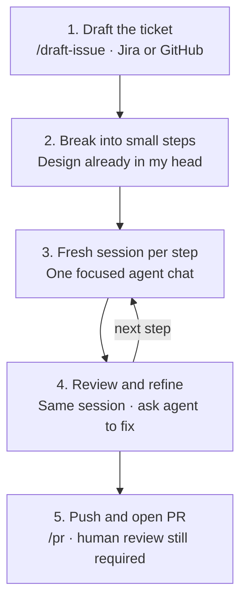

# How I Actually Use Cursor

*What ~5,400 agent sessions taught me about shipping with an AI pair — and what you can steal from the pattern.*

Sep 8, 2026 · Mohammad Hamrah

---

## What you will read

This is a field note on how I use Cursor to ship real work — not a feature tour of the product.

You will see the end-to-end process I follow (ticket first, small steps, fresh sessions, review, then PR), what my sessions actually look like across roughly 5,400 agent chats, a few fictionalized samples that open with goal / expected result / technical notes, and the operating rules I learned the hard way: guide the agent but let it edit, always review before commit, prefer Auto for known work, and keep context lean.

The through-line is simple: **ticket → small steps → fresh sessions → review & refine → PR.**

---

## Why I looked at my own usage

Most AI-coding posts describe what the tool *can* do. I wanted something more honest: what *I* actually do with it when the goal is a merged change.

So I sampled my agent transcripts, counted how sessions start, what they ask for, how often they continue, and when they happen. The numbers are approximate and keyword-based — useful as a signal, not as a scientific study. Still, the signal was strong enough to name — and strong enough to write down the process I now run on purpose.

---

## My process

This is the workflow I return to on almost every feature.



### 1. Start from a ticket

I never start implementation from a blank chat. Work begins as an issue in whatever tracker the project uses — **Jira at ApplyBoard**, **GitHub Issues on personal projects**.

I use a `/draft-issue` command to draft and create that issue first. Only after the ticket exists do I begin implementation. The ticket is the contract: it forces the problem, scope, and acceptance criteria into writing before the agent starts typing code.

### 2. Break the design into small steps — each in a fresh session

By the time I open the agent, I usually already have the design in my head. I do not dump the whole feature into one long conversation. I slice it into smaller steps and ask the agent to tackle **one step per brand-new session**.

Fresh sessions keep context focused. Small steps keep blast radius reviewable. If a step goes sideways, I lose a slice of work — not an entire feature thread.

### 3. Review and refine in the same session

When the agent finishes a step, I review the diff immediately. Refinements happen **in that same session**: tighten naming, match existing patterns, fix edge cases, adjust the UI. Short corrections beat starting over, as long as the step itself was scoped tightly enough.

### 4. Ship with `/pr`

When the change is ready, I use a `/pr` command that pushes the branch and opens a pull request with a proper description. The agent helps with the last mile of shipping, but the PR is still a human checkpoint — description, diff, and intent should make sense to a reviewer who was not in the chat.

In short:

1. Draft the issue (`/draft-issue`)
2. Split the work into small steps
3. Implement each step in a new agent session
4. Review and refine in-session
5. Push and open the PR (`/pr`)

---

## What the sessions look like in practice

### I use it where I already ship

Almost all sessions live in day-job repositories. Personal projects barely show up. Within work, usage concentrates in a few primary codebases rather than spreading thinly everywhere.

That matters if you are adopting an agent at work. The payoff showed up for me when the tool sat inside the same repos I already knew — not when I treated it as a weekend experiment.

### I ask it to build more than I ask it to explain

Opening prompts cluster roughly like this (a prompt can land in more than one bucket). Normalized into relative slices for a pie view:

| Slice | Normalized share |
| --- | ---: |
| Build / implement | 24% |
| UI changes | 16% |
| Agent / meta | 14% |
| Bug fix | 9% |
| Explain / explore | 8% |
| Git / PR | 7% |
| Other (review, infra, docs, refactor, tests) | 23% |

Original rough shares (overlapping keyword buckets):

| Kind of ask | Rough share of sessions |
| --- | ---: |
| Build / implement / add | ~30% |
| UI and interaction changes | ~20% |
| Agent, prompts, and tooling meta-work | ~15–20% |
| Bug fixes and failures | ~10–12% |
| Explain / explore / locate | ~10% |
| Git, branches, PRs | ~9% |
| Review / check | ~8% |
| Infra and config | ~7% |
| Docs and writing | ~6% |
| Refactors | ~5% |
| Tests / CI | ~4% |

The center of gravity is shipping: add the feature, fix the UI, clear the breakage. Exploration exists, but usually as preparation for a change. A meaningful slice is also “meta” — improving prompts, tools, and workflows — because the agent itself became something I maintain, the way I would maintain CI.

### My prompts sound like tickets

About **91%** of openings are imperative (“add…”, “fix…”, “rename…”, “explore…”). Only about **9%** are questions.

In practice that means:

- a short directive when the target is obvious
- a longer brief when the blast radius is large
- bullet constraints when acceptance criteria matter

Median opening length is short — on the order of **15 words**. The average is much longer because some sessions start with pasted logs or multi-constraint specs. The useful mental model is bimodal: quick nudges and scoped briefs, not endless conversation.

### I ground the agent before I let it guess

Two habits show up constantly:

1. **`@` file and folder references** — about half of sessions attach a concrete location.
2. **Screenshots** — about 14% of sessions start from an image, usually a UI state that is faster to show than to describe.

When the UI is wrong, I show the UI. When the code path is known, I point at the file. The agent works inside a frame I chose; it does not invent the frame.

### I correct in short bursts

Nearly half of sessions become multi-turn. Follow-ups are usually not new essays. They look like:

- tighten spacing
- rename something
- match an existing pattern
- undo a wrong assumption

About **seven in ten** follow-ups are under 100 characters. That feels like pair programming with a very fast junior who needs crisp redirects — not like outsourcing ownership.

### A few sample sessions (fictionalized)

The strongest openings in my history are not one-liners. They read like a ticket: a defined goal, expected outcomes (or acceptance criteria), and technical notes that bound the change. The prompts below keep that spirit and shape, but they are invented for a fictional product (“Harbor Desk”) — not copied from production work.

**1. Playbooks as a small filesystem** — Goal · expected capabilities · technical notes · `@` model anchor

```text
@apps/api/src/models/playbook.schema.ts

Goal:
1. Users should be able to manage multiple playbook pages
2. Users should be able to organize pages into folders (including nested folders)
3. Users should be able to view and edit a page
4. Users should be able to browse all folders and pages in an explorer view

Technical Notes:
---------------------
- We need a filesystem-style tree
- On the frontend, we need a folder/page explorer with a light markdown editor
- Users should be able to save with a Save button or Ctrl/Cmd+S
```

**2. Structured fulfillment logging and stats** — Goal · implementation expectations · technical notes · capture checklist

```text
Goal:
Build a better logging system for fulfillment runs so we capture and store logs in a structured way we can process later.

Implementations
-----------------
- We need an entity to store each run as a sequence of steps
- We need an entity to capture execution stats (every execution's stats should include cost tags)
- Workers should delegate jobs, capture logs, and store them
- Workers should capture stats and store them
- The UI should surface logs and stats in a clearer view
----------------------------
Notes:
----------------------------
- Tools should log their tasks by passing parameters to the logger; the logger stores them in the database
- The worker should pass context parameters into every tool call
- Tools should also call the logger whenever stats are captured
--------------------------------
logger = @apps/api/src/jobs/tools/run-logger.ts (not the application-level logger)
tools = @apps/api/src/jobs/tools
---------------------------------
What could be captured:
- Step title
- Step command
- Step logs
- Step status

What could be captured as stats:
- Token usage
- Model name
- Run cost
```

**3. Embeddable waitlist snippet for admins** — Story · acceptance criteria · technical notes

```text
@apps/admin
------------------
Story:
As a Workspace Admin, I want to copy the waitlist widget snippet and load it on my own website.

ACs:
- A /settings page contains a copyable box with the snippet script
- The marketing landing page loads the widget for the default workspace

Technical Notes:
- We need a data migration to seed a default workspace
- We need to build a new settings page
```

**4. Freeze paid features when the plan is exhausted** — Acceptance criteria · tech note with `@` line anchor

```text
ACs:
- When the workspace plan is expired, or remaining credits are limited/exhausted, the drafting assistant is disabled (no new runs; assistant UI is not operable)
- All AI features in the admin panel are disabled under the same condition
- Library ingest (sources, library UI, and related uploads) is disabled under the same condition
- Public booking flows for the workspace are disabled under the same condition
- Usage and dashboard surfaces show a clear reason for the restriction (expired vs. credit-limited)
- The Members page is read-only under the same condition (view allowed; create/update/destructive actions blocked)

Tech notes:
Use @apps/api/src/auth/entitlements.ts:14 to check the ACs
```

This is the longer side of the bimodal prompt habit: when blast radius matters, I write the contract up front — then refine in short bursts after the first diff.

### I encode preferences as rules

Persistent user rules around commits, pull requests, and frontend craft are part of the system. Examples of the spirit:

- do not commit unless asked
- do not push unless asked
- prefer small, reviewable diffs
- avoid generic “AI default” UI looks when designing

The more you trust an agent to act, the more you need to constrain *how* it acts. Rules are governance, not decoration.

### Timing is honest, not ideal

My sessions skew away from a classic 9–5 curve. Late night is densest; evenings next; weekends — especially Sundays — carry a large share. I am not recommending that schedule. I am saying deep agent work often landed when interruptions dropped and the change was already clear in my head.

---

## What I’ve learned

These are the operating rules that matter more than any single prompt trick.

### Guide tightly — then let the agent do the editing

I learned that I need to steer the agent clearly, but I should **not** rewrite its output by hand. If something is wrong, I ask the agent to fix it. That keeps ownership of the diff with the agent, preserves momentum, and avoids a half-manual / half-generated mess that nobody can reproduce.

### Never trust the result until you review it

I do not commit what I have not read. The agent is fast; it is not accountable. Review before commit is non-negotiable — every step, every PR.

### Take backend and API work more seriously than frontend polish

I put more seriousness into backend and API changes than into visual polish. A visual bug is annoying. A bad database design or a security leak can harm customers. When attention is limited, I spend it where failure is expensive.

### Default to Auto mode

I use **Auto** mode for most work. I rarely switch to higher-tier models for routine implementation. For work I already understand and have broken into steps, Auto is enough.

### Use stronger models when you do not know the shape yet

When I am unsure what I need, I reach for models like **Opus** or **Grok** and let them propose an implementation that makes sense. If the result is good, I review it and keep going. If it is not, I still win: now I know what I actually need. I break that insight into smaller steps and implement them with Auto.

### Skip Plan mode most of the time

I rarely use Plan mode. For my workflow it is usually a detour. It is faster to see a concrete implementation, judge it, and refine — or discard it and re-slice the work — than to spend cycles on a plan I will rewrite anyway.

### Keep context minimal on purpose

I actively watch context usage and try to keep it lean. That is why steps live in fresh sessions, why prompts stay pointed, and why I avoid stuffing a whole feature into one chat. Minimal context is not austerity for its own sake — it is how I keep the agent sharp.

---

## The pattern you can reuse

I call it:

**Ticket-first, step-sized, directed execution — with visual grounding and a short correction loop.**

In steps you can try tomorrow:

1. Create the ticket before any implementation.
2. Break the design in your head into small steps.
3. Run each step in a fresh agent session.
4. Point at the real artifact (file, screenshot, failing log).
5. State the change in imperative language; bound it when quality matters.
6. Review the diff; refine in the same session by asking the agent — not by hand-editing.
7. Close with your normal finish line (`/pr` or equivalent).

What this is *not*: endless architecture chat with no diff, blind “rewrite the module” prompts with no anchors, trusting Auto without reading the result, or treating autocomplete as the whole product.

---

## Conclusion

Looking at my own Cursor history confirmed something I had felt but not measured: the agent creates the most leverage when I already know the codebase, already know the change, and use it to **shorten the distance between judgment and a landed diff**.

For me that means a ticket first, small steps in fresh sessions, imperative prompts, `@` references and screenshots, in-session refinement without hand-editing the agent’s work, review before every commit, Auto by default, stronger models only when the problem is still fuzzy, and a `/pr` command to close the loop. Backend and API risk get more of my attention than cosmetic UI debt. Context stays as small as I can keep it.

If you take nothing else from this article, take the process: **ticket → small steps → fresh sessions → review & refine → PR.** Adapt it to your tracker and your standards. Keep ownership of the judgment. Let the agent carry more of the typing.

That has been my experience — and it is the version of AI-assisted engineering I am comfortable recommending to other builders.
